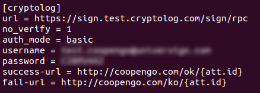

## Trytond Cryptolog

This is trytond module to sign tryton `ir.attachment` via [Cryptolog](https://www.universign.eu/fr/) service.

### How to use

- `trytond.conf`

- `ir.attachment` view changes

